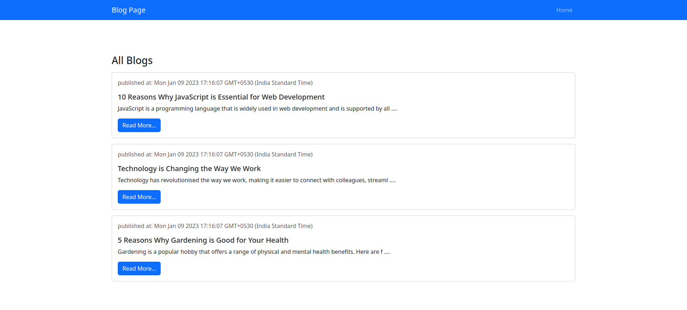
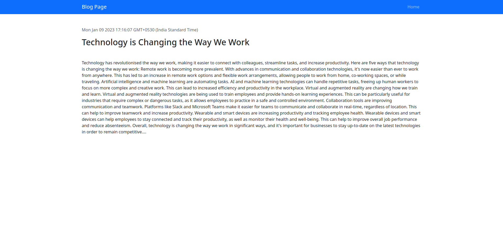
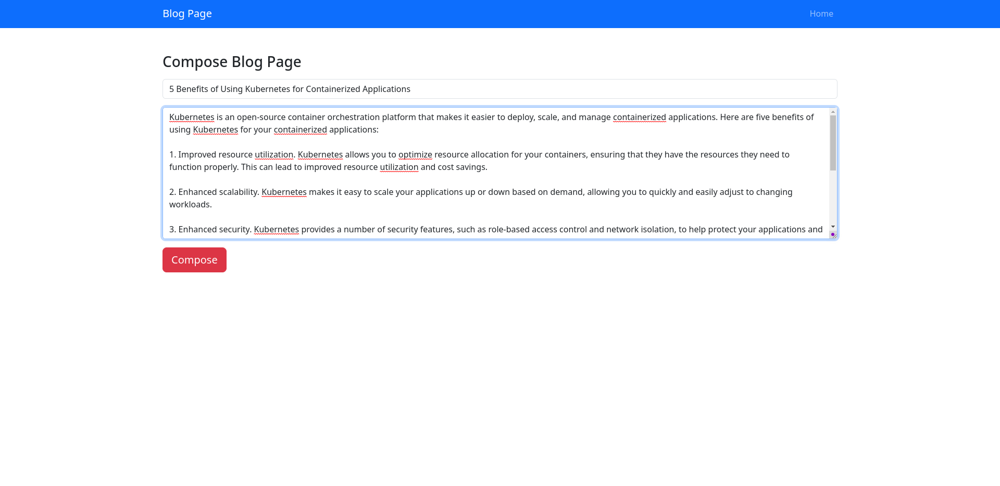

# blog_it

Welcome to the Blog Project repository! This project is a simple blogging platform that allows users to create, edit, and publish blog posts.


## Prerequisites

Before you begin, make sure you have the following tools installed on your machine:

[Node.js](https://nodejs.org/)  
[MongoDB](https://www.mongodb.com/) 
## Run Locally

Clone the project

```bash
  git clone https://github.com/shivang0-0/blog_it.git
```

Go to the project directory

```bash
  cd blog_it
```

Install dependencies

```bash
  npm install
```

Start the server

```bash
  npm run devStart
```

The blog platform should now be running on http://localhost:3000/.

## Screenshots

  
  



## Built with

[Express](https://expressjs.com/)- Web framework for Node.js  
[MongoDB](https://www.mongodb.com/)- NoSQL database  
[Mongoose](https://mongoosejs.com/)- MongoDB object modeling for Node.js


## Contributing

If you would like to contribute to the project, please fork the repository and submit a pull request with your changes.

